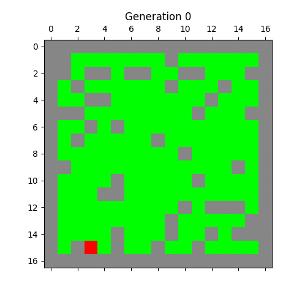
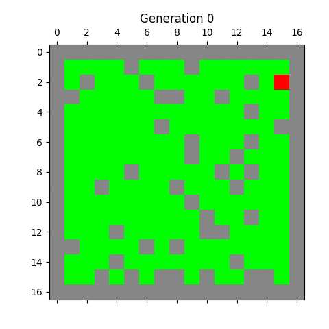
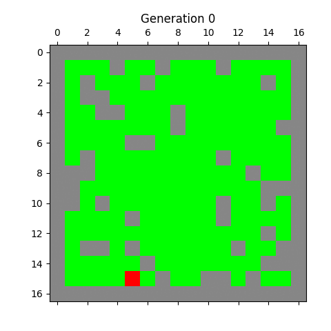
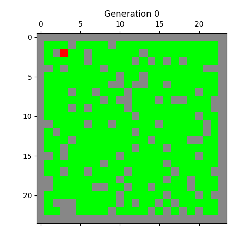

*My school project for the computer simulations course.*

A Python program simulating forest fires using `numpy`, `matplotlib` and `random` libraries.

The project's goal was to simulate a cellular automaton representing a forest fire with a visualization. The automaton starts by randomly placing elements that represent states. Then, a fire starts in a randomly chosen place. The simulation ends after a specified number of iterations or when the fire stops.

**The automaton has 4 states:**
- burnt tree
- burning tree
- tree
- rock

**Evolution rules:**
- A tree becomes a burning tree with the probability `p` if it neighbors a burning tree (Moore Neighborhood)
- A burning tree becomes a burnt tree in the next generation
- A burnt tree stays a burnt tree
- A rock stays a rock

**Example outcomes:**

   
